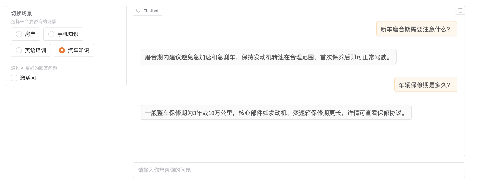

# Multi Scenario-Chatbot 


## 介绍

Multi Scenario-Chatbot 是一个使用 AI LLM结合 RAG 技术 实现基于不同场景下的 AI  机器人 智能问答系统.

这个工具使用了大型语言模型 (LLMs) 。  它是用 Python 构建的，并且具有灵活、模块化和面向对象的设计。


## 特性

- [x] 基于Langchain 大模型中间件开发
- [x] 图形化场景进行机器人聊天
- [x] 涉及房产，英语培训，手机及汽车 4个领域的知识问答


## 开始使用

### 环境准备

1.克隆仓库 `git clone `

2.需要 Python 3.10 或更高版本，使用 pip install  提前安装依赖项

3.默认使用OpenAI LLM gpt-3.5-turbo 进行调用

### 使用示例

您可以通过指定配置文件或提供命令行参数来使用 OpenAI-Translator 工具。

命令行直接运行：

```bash
python sales_chatbot.py
```


## 运行页面案例



## 许可证

该项目采用 GPL-3.0 许可证。有关详细信息，请查看 [LICENSE](LICENSE) 文件。

### 参考

此项目参考https://github.com/DjangoPeng/openai-quickstart


